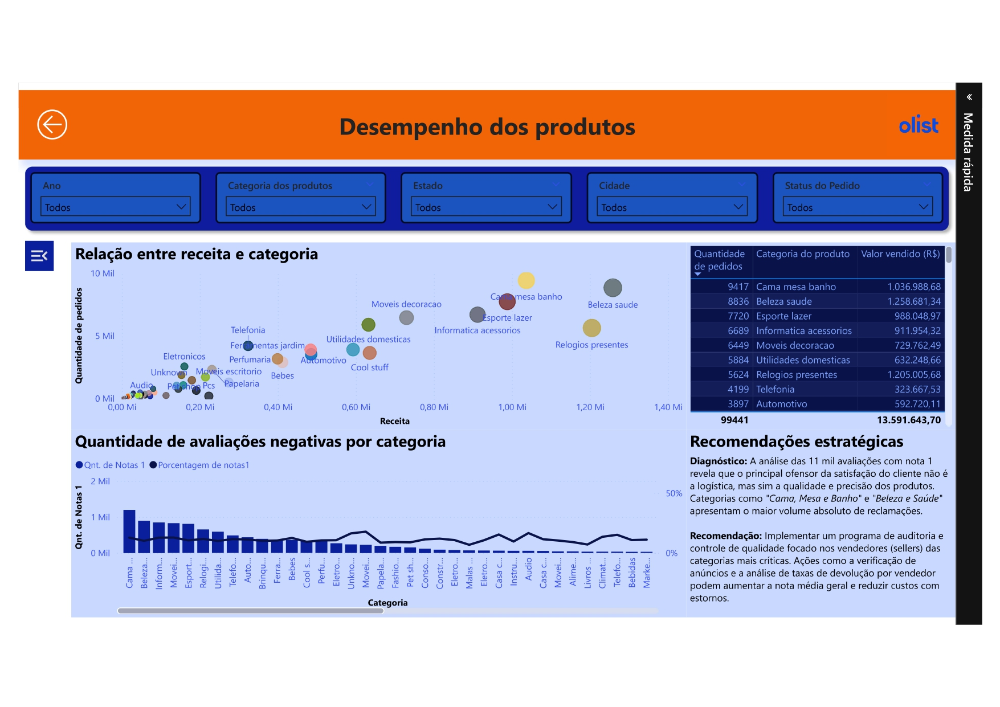

# Análise de satisfação do cliente | Olist E-commerce

## Objetivo de negócio

Analisar os dados da Olist para diagnosticar as principais causas de insatisfação do cliente, visando identificar oportunidades de melhoria para elevar a nota média de satisfação, que atualmente é de 4,09.

## Análise e recomendações

A análise foi consolidada em um dashboard interativo no Power BI. Contrariando a hipótese inicial de que a logística era o principal problema, a análise aprofundada das 11 mil avaliações com nota 1 revelou que o maior ofensor da satisfação é, na verdade, a **qualidade e precisão dos produtos enviados**.

A investigação apontou que categorias específicas, como "Cama, Mesa e Banho", concentram o maior volume absoluto de reclamações.

**Recomendação estratégica:**
Implementar um programa de auditoria e controle de qualidade focado nos vendedores (sellers) das categorias mais críticas. Ações como a verificação de anúncios e a análise de taxas de devolução podem aumentar a nota média geral e reduzir custos com estornos e devoluções.

## Ferramentas utilizadas
* **Linguagem:** Python (Pandas, Matplotlib, Seaborn)
* **Banco de Dados:** SQLite
* **BI e Visualização:** Power BI

## Dashboard principal
- **Desempenho dos produtos**

  

---
## Acesso ao relatório interativo

O arquivo `.pbix` completo, com todas as tabelas, medidas DAX e interações, está disponível para download e visualização no link abaixo.

[➡️ **Acessar o projeto Power BI completo no Google Drive**](https://drive.google.com/file/d/1R4hW9zsVKh-vIELG7aB-BI42ijM68C8Y/view?usp=sharing)

*(Nota: O arquivo tem aproximadamente 70MB, pois contém uma cópia completa dos dados tratados para permitir a análise offline.)*
