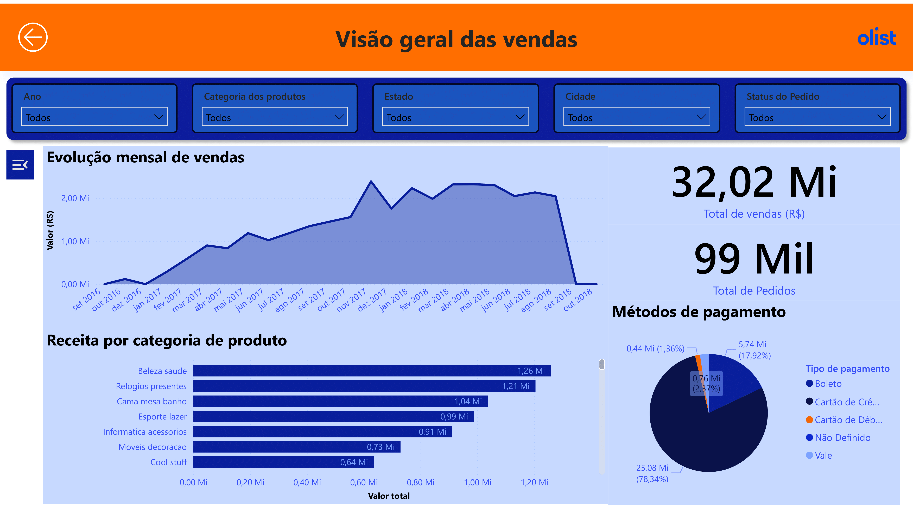
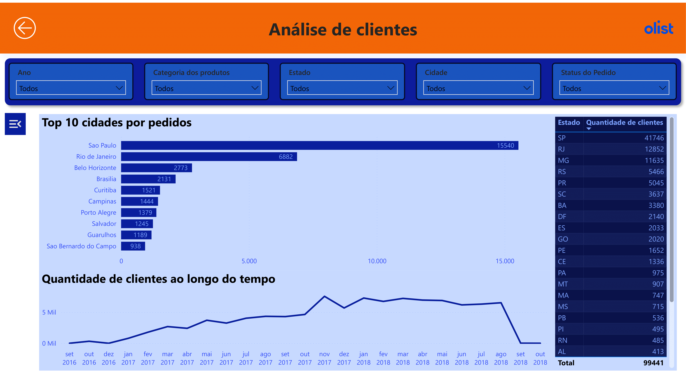
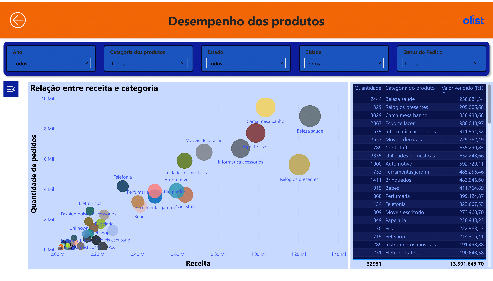
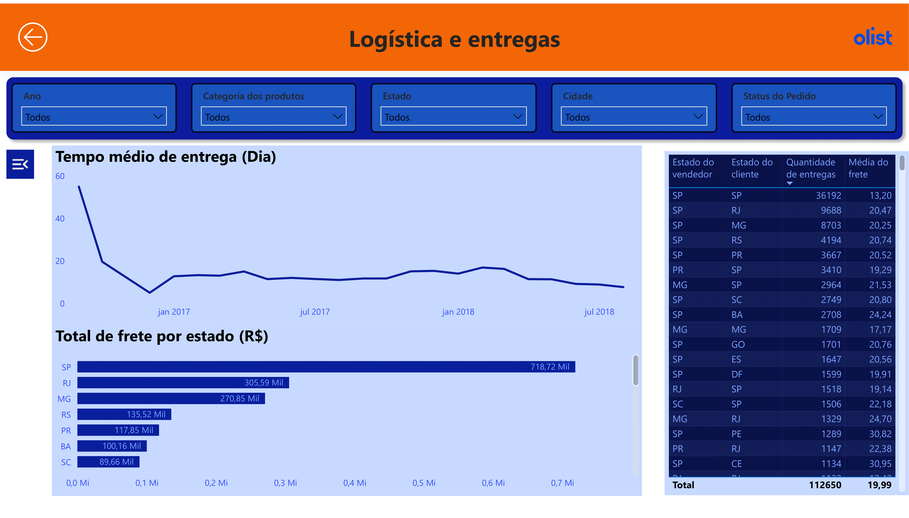

# Análise de dados de Brazilian E-Commerce Public Dataset by Olist

## Visão geral

Este projeto realiza uma análise detalhada dos dados de e-commerce da Olist, abordando vendas, logística e satisfação do cliente. Utilizamos Python, SQL e Power BI para transformar dados brutos em insights acionáveis.

## Sumário

- [Introdução](#introdução)
- [Objetivos](#objetivos)
- [Metodologia](#metodologia)
- [Ferramentas e tecnologias](#ferramentas-e-tecnologias)
- [Análises realizadas](#análises-realizadas)
- [Visualizações no Power BI](#visualizações-no-power-bi)
- [Execução do projeto](#execução-do-projeto)
- [Contato](#contato)

## Introdução

No cenário atual de comércio eletrônico, onde a competição e as expectativas dos clientes crescem a cada dia, entender os dados é crucial para o sucesso. A Olist, uma plataforma que ajuda pequenas e médias empresas a venderem mais, disponibiliza um conjunto robusto de dados do e-commerce brasileiro, permitindo uma análise aprofundada de suas operações.

Este projeto convida você a explorar esses dados junto conosco. Vamos desvendar padrões de comportamento do consumidor, analisar a eficiência logística e avaliar a satisfação do cliente. Utilizando ferramentas como Python e Power BI, transformamos dados em insights valiosos que ajudam a contar a história por trás das transações diárias.

Cada gráfico e cada visualização construídos aqui têm o objetivo de oferecer uma nova perspectiva, simplificando decisões complexas para melhorar a estratégia de negócios. Esperamos que este projeto inspire novas ideias e promova um entendimento mais profundo das dinâmicas do e-commerce.

## Objetivos

- Obter insights sobre a performance de vendas.
- Analisar a eficiência logística.
- Avaliar a satisfação do cliente por meio de reviews.

## Metodologia

### Obtenção e limpeza de dados

1. **Download do dataset**: Kaggle - [Brazilian E-Commerce](https://www.kaggle.com/datasets/olistbr/brazilian-ecommerce).
2. **Tratamento de dados com Python**: Limpeza de dados usando pandas, tratamento de valores nulos e tipos de dados.
3. **Consultas SQL**: Análises específicas como tempos de entrega e resposta.

Os dados originais estão na pasta `data/original/` e os dados tratados, utilizados para análise e visualizações, estão na pasta `data/treated/`.

### Análise e visualização

1. **Power BI**: Criação de dashboards interativos para insights visuais, utilizando os dados tratados disponíveis em `data/treated/`.

## Ferramentas e tecnologias

- **Python**: Bibliotecas pandas, numpy, matplotlib, seaborn
- **SQL**: Consultas complexas para análise de dados
- **Power BI**: Visualização de dados
- **Kagglehub**: Acesso ao dataset

## Análises realizadas

- **Tempo médio de entrega**: Identificação de estados com maior eficiência.
- **Distribuição de avaliações**: Insights sobre satisfação do cliente.
- **Tendências de vendas por categoria**: Identificação de categorias populares.

## Visualizações no Power BI

As imagens dos dashboards abaixo estão localizadas na pasta `images/`, enquanto o projeto do Power BI está em `powerbi/`.

- **Visão geral das vendas**

  

- **Análise de clientes**

  

- **Desempenho dos produtos**

  

- **Logística e entregas**

  

- **Satisfação do cliente**

  

## Execução do projeto

### Pré-requisitos

- Python 3.x
- Power BI

### Passos

1. Clone o repositório:
    ```bash
    git clone https://github.com/GustavoFLOli/ecommerce_data_analysis_olist.git
    ```
2. Instale as dependências:
    ```bash
    pip install -r requirements.txt
    ```
3. Execute os notebooks em `notebooks/` para tratamento de dados.
4. Importe os dados tratados no Power BI para visualizar os dashboards.

## Contato

- **LinkedIn**: [Gustavo Oliveira](https://www.linkedin.com/in/gustavo-fl-oliveira/)
- **Email**: [gustavo.f.lima.oliveira@gmail.com](mailto:gustavo.f.lima.oliveira@gmail.com)
